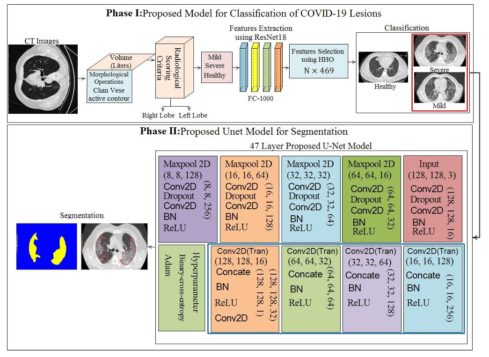

# COVID-19 Grading & Segmentation System

**Validation of COVID-19 Grading System based on Harris Hawks Optimization (HHO) and Variational Quantum Classifier using JLDS-2024**  
*Javaria Amin, Nadia Gul, Muhammad Sharif, Steven L. Fernandes* 
<a href='https://www.frontiersin.org/journals/radiology/articles/10.3389/fradi.2025.1457173/abstract'></a>



---

## Repository Structure

```
COVID-19-Grading-System/
├── Notebooks/
│   ├── Classification_Model.ipynb           # Contains the code for training and inference of classification model
│   └── Segmentation_Model.ipynb           # Contains the code for training and inference of segmentation model
├── volumetric_analysis.py          # Contains the code for volumetric analysis
├── train_classification.py          # Classification model training script
├── classification_model_inference.py      # Classification model inference script
├── train_segmentation.py   # Segmentation model training script
├── segmentation_model_inference.py # Segmentation model inference script
├── data/
│   ├── classification/           # Place classification dataset here
│   └── segmentation/
│       ├── images/               # CT scan images
│       └── masks/                # Ground truth segmentation masks
├── models/                       # Saved model weights
│   ├── classification/
│   └── segmentation/
└── results/                      # Results from inference scripts
```

## Getting Started

### 1. Environment Setup
Git clone our repository and install the required dependencies
```bash
git clone https://github.com/ai-research-2025/COVID-19-Grading-Segmentation.git
cd COVID-19-Grading-Segmentation
pip install tensorflow torch torchvision opencv-python pillow scikit-learn pandas matplotlib albumentations tqdm
```

### 2. Dataset Preparation
- **Classification Dataset**:  
  Download the [COVID-CT Dataset](https://www.dropbox.com/scl/fi/i4xntov2doyebjy9pos4j/dataset.zip?dl=0&e=1&rlkey=ld3vegd1ofnpupoupnia0nex2&st=nmw8a3zt) and organize into `data/classification/`.
  Download the [JLDS-2024 Dataset](https://www.dropbox.com/scl/fi/hdjiytlxn7kgujkazdf8c/JLDS-2024.zip?rlkey=our57xic54jxhr1g5xb2eqnh1&st=nvfrer4w&dl=0) and organize into `data/classification/`.
- **Segmentation Dataset**:  
  Use the [COVID-19 CT Segmentation Dataset](http://medicalsegmentation.com/covid19/) and organize into `data/segmentation/images/` and `data/segmentation/masks/`.

### 3. Pretrained Models
You can download the trained models weights and use them directly:
- Trained classification model: [Download here](https://www.dropbox.com/scl/fi/t6b122vyhqah6l91owf5d/trained_model.pth?rlkey=i4t22i2cg311030opjd7lamw6&e=1&st=zh3vrya1&dl=0).
- Trained feature selector: [Download here](https://www.dropbox.com/scl/fi/eh7xqt4m0dtiqktsdodos/feature_selector.pkl?rlkey=pou1jfqq0pw7uhlytb5uenwyh&e=1&st=fy8hqhof&dl=0).
- Trained U-Net weights: [Download here](https://www.dropbox.com/scl/fi/zmgdzjs68f3hcr8zo7kio/segmentation_model.h5?rlkey=3nxon1gwjp28iikj3wbz55m1t&e=1&st=465tz55n&dl=0).

---

## Classification Model

### Training

Train the classification model using the provided script:

```bash
python train_classification.py --dataset "data/classification" --output "models/classification" --epochs 100 --batch_size 8 --num_features 446
```

#### Parameters:
- `--dataset`: Directory containing training images organized in class subdirectories
- `--output`: Directory to save trained model and feature selector
- `--epochs`: Number of training epochs (default: 100)
- `--batch_size`: Training batch size (default: 8)
- `--num_features`: Number of features to select with HHO (default: 446)

### Inference

Run inference using the trained classification model:

```bash
python classification_model_inference.py --model "models/classification/trained_model.pth" --feature-selector "models/classification/feature_selector.pkl" --input "path/to/image_or_directory" --output "results/classification_results.csv"
```

#### Parameters:
- `--model`: Path to trained model file (.pth)
- `--feature-selector`: Path to feature selector file (.pkl)
- `--input`: Path to image or directory of images to classify
- `--output`: Path to save results (optional, CSV format)

---

## Segmentation Model

### Training

Train the segmentation model using the provided script:

```bash
python train_segmentation.py --images "data/segmentation/images" --masks "data/segmentation/masks" --output "models/segmentation" --epochs 100 --batch-size 8 --img-size 128
```

#### Parameters:
- `--images`: Directory containing training images
- `--masks`: Directory containing corresponding segmentation masks
- `--output`: Directory to save trained model and results
- `--epochs`: Number of training epochs (default: 100)
- `--batch-size`: Training batch size (default: 8)
- `--img-size`: Image resolution (default: 128)
- `--val-split`: Validation split ratio (default: 0.2)

### Inference

Run inference with the trained segmentation model:

```bash
python segmentation_model_inference.py --model "models/segmentation/best_model.keras" --input "path/to/image_or_directory" --output "results/segmentation" --threshold 0.5 --img-size 128 --save-overlay
```

#### Parameters:
- `--model`: Path to trained model file (.keras or .h5)
- `--input`: Path to input image or directory of images
- `--output`: Directory to save output predictions
- `--masks`: Optional path to ground truth masks for evaluation
- `--threshold`: Threshold for binary segmentation (default: 0.5)
- `--img-size`: Image resolution for inference (default: 128)
- `--save-overlay`: Save overlay visualization of predictions on images

---

## Pipeline Workflow

1. **Data Preparation**:
   - Organize and preprocess CT scan images

2. **Segmentation**:
   - Train or use pre-trained segmentation model to identify COVID-19 lesions in CT scans
   - Generate binary masks showing affected lung regions

3. **Feature Extraction & Classification**:
   - Extract features from CT scans using ResNet-18
   - Apply HHO feature selection to identify the most relevant features
   - Train classifier to distinguish between COVID-19 and normal cases

4. **Evaluation & Reporting**:
   - Generate quantitative results including Dice scores for segmentation
   - Produce classification metrics (accuracy, precision, recall)
   - Create visualizations of affected regions

---

## Evaluation Results

| Task          | Metric       | Performance   |
|---------------|--------------|---------------|
| Classification| Accuracy     | 99.0% (JLDS)  |
|               | ROC-AUC      | 0.98 ± 0.01   |
| Segmentation  | Dice Score   | 0.892         |

---

## Acknowledgements
- UCSD-AI4H/COVID-CT Dataset [[1]](https://arxiv.org/abs/2003.13865)
- COVID-19 CT Segmentation Dataset [[2]](http://medicalsegmentation.com/covid19/)
- Harris Hawks Optimization (HHO) algorithm [[3]](https://doi.org/10.1016/j.future.2019.02.028)

---

## Citation
```bibtex
@article{amin5validation,
  title={Validation of COVID-19 Grading System based on Harris Hawks Optimization (HHO) and Variational Quantum Classifier using JLDS-2024},
  author={Amin, Dr Javaria and Sharif, Muhammad and Fernandes, Steven and others},
  journal={Frontiers in Radiology},
  volume={5},
  pages={1457173},
  publisher={Frontiers}
}
```
